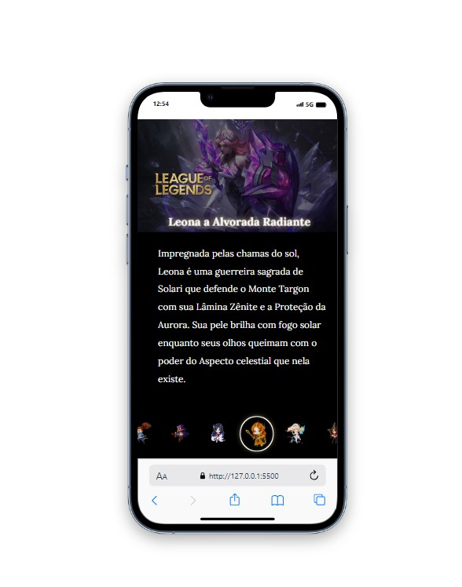

# Projeto com o jogo League of Legends

O projeto é uma página web interativa dedicada ao fascinante mundo dos personagens do jogo League of Legends. Aqui, apresentamos uma experiência envolvente que permite aos entusiastas explorar alguns personagens do game.

<br>
<br>

# Sobre o jogo

## Mergulhe num mundo de aventura e magia 🌈🏆⚔🛡🛡
League of Legends é um jogo de estratégia em que duas equipes de cinco poderosos Campeões se enfrentam para destruir a base uma da outra. Escolha entre mais de 140 Campeões para realizar jogadas épicas, assegurar abates e destruir torres conforme você luta até a vitória.

<br>
<br>

# Visualização do Projeto




## Tecnologias utilizadas

- HTML     
- CSS   
- Javascript

## Como utilizar

1-clone para o projeto
```
git clone <url>
```

2-Acesse a pasta do projeto
```
cd repositorio-com-readme
```

## Sua Opinião Importa

Se você explorou O projeto e tem alguma observação, sugestão ou apenas deseja entrar em contato, por favor, compartilhe conosco. Valorizamos seu feedback e estamos constantemente buscando maneiras de melhorar. Seu insight é valioso e ajuda a aprimorar nosso projeto. Não hesite em nos contatar, mesmo que seja apenas para dizer "oi." Aguardamos ansiosamente seu contato e agradecemos sua participação em nossa jornada.


